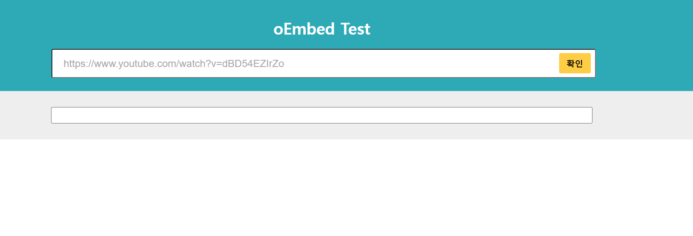
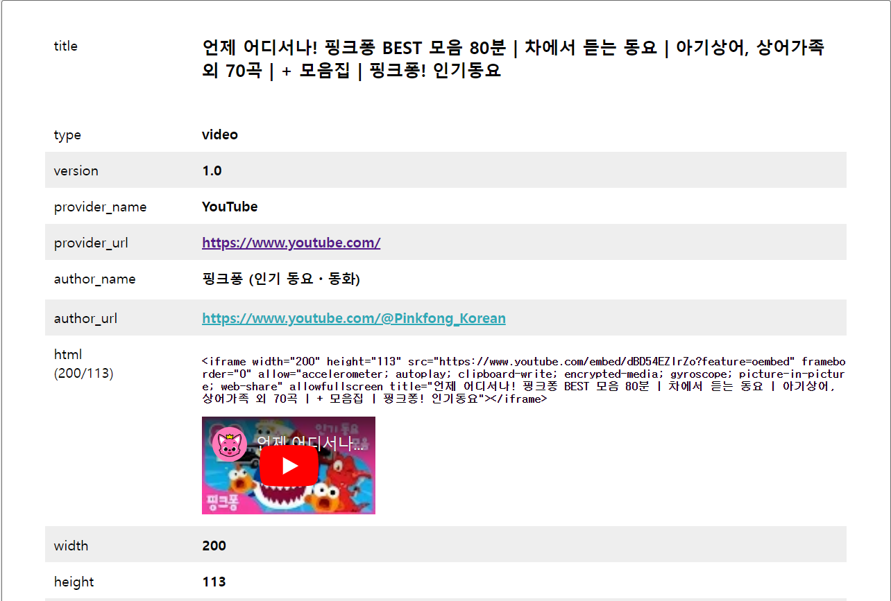
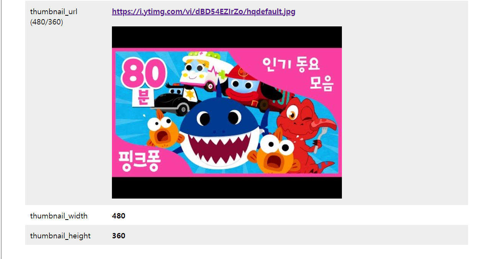

# oEmbed API 프로젝트
## 프로젝트 구조

- API 서버 (java 11) - Spring boot 사용
- 웹 클라이언트 (html, css, js)

### API 서버

- Controller
  - EmbedController - 웹 클라이언트의 요청을 처리할 컨트롤러
  - ExceptionController - 예외 처리 컨트롤러
- Service
  - EmbedService - 서비스 인터페이스
  - EmbedServiceImpl - 서비스 인터페이스 구현체 Connector를 호출
- Connector
  - EmbedConnector - oEmbed 데이터 핸들러 및 실제 oEmbed API를 호출
- Util
  - HttpsUtils - Connector로 부터 받은 url에 Https 통신으로 요청할 클래스
- Domain
  - ApiResponse - 웹 클라이언트에 응답할 객체
  - Embed - 플랫폼 별 Embed API로부터 받을 상위 객체
  - Youtube - Youtube Embed API로부터 받을 객체
  - Twitter - Twitter Embed API로부터 받을 객체
  - Vimeo - Vimeo Embed API로부터 받을 객체
- Const(enum)
  - ApiStatus - API 응답 상태 열거형 클래스
  - EmbedChannelType - Embed 플랫폼 열거형 클래스

### 웹 클라이언트

- html
  - home.html
- js
  - home.js
- css
  - home.css

### 시나리오 및 실행 결과

1. 검색 인풋에 `https://www.youtube.com/watch?v=dBD54EZIrZo` 입력 후 확인 버튼 클릭
2. home.js의 `requestUrl()`메소드에서 `EmbedController`의 `/search`호출
3. 웹 클라이언트로부터 받은 url을 `Embed` 객체에 set해 `EmbedService.getEmbedInf(Embed embed)`호출
4. `EmbedServiceImpl`에서 받은 `Embed` 객체 그대로 `EmbedConnector.callEmbedApi(Embed embed)`호출

**EmbedConnector**
```java
public Embed callEmbedApi(Embed embed) throws IOException {
    //ObjectMapper - json을 객체로 변환해주기 위해 호출
    ObjectMapper mapper = new ObjectMapper();

    //입력받은 Url을 urlencode형식으로 인코딩
    String url = URLEncoder.encode(embed.getUrl(), StandardCharsets.UTF_8);

    //url에서 채널 조회
    EmbedChannelType embedChannelType = EmbedChannelType.getUrlEmbedType(url);

    //채널에 맞는 endpoint url을 가져온다.
    String endpointUrl = channelEndPointMap.get( embedChannelType.getCode() );

    /* oEmbed API를 호출할 url 생성
        기본 반환값이 json 형식이므로 format 생략 */
    String callUrl = endpointUrl + "?url=" + url;

    //API 호출
    String jsonData = httpsUtils.httpsRequestGet(callUrl);

    return mapper.readValue(jsonData, Embed.getClass( embedChannelType ));
}
```
5. oEmbed API를 요청후 데이터 처리
   1. 받은 url `https://www.youtube.com/watch?v=dBD54EZIrZo` urlencode 형식으로 인코딩
   2. 해당 url을 `EmbedChannelType.geturlEmbedType(String url)` 인자로 넣어 사용할 `Embed` 채널 타입을 가져온다.
   3. `application.yml`에 정의해놓은 플랫폼별 endpoints url을 가져온다.
   Ex) Youtube -> https://www.youtube.com/oembed
   4. endpoints url과 입력받은 url을 조합해 oEmbed API를 요청할 url을 조립한다.
   5. 해당 url로 HttpsUtils 호출
   6. 응답받은 json 데이터를 `ObjectMapper`를 사용해 객체로 변환
      1. 이때 변환할 객체를 5-2에서 가져온 `Embed` 채널 타입으로 변환한다.
6. EmbedConnector로부터 -> EmbedService -> EmbedController -> 웹 클라이언트 데이터 응답
7. home.js에서 `drawEmbedInf(embed)`를 호출해 화면에 데이터 표시

